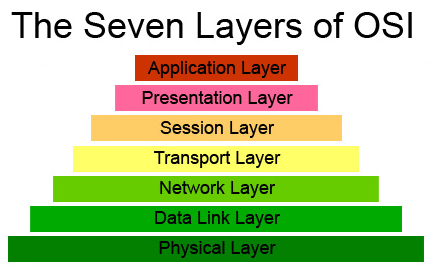
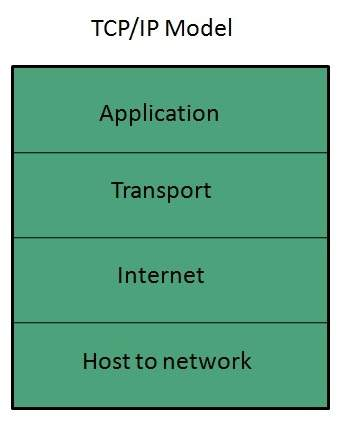

**Rangkuman Pertemuan 1 Sistem Keamanan Jaringan**

  

Latar Belakang Masalah

1. Apa saja layer yang ada pada OSI Layer?
2. Apa fungsi dari masing – masing layer pada OSI Layer?
3. Berilah contoh protocol maupun perangkat pada OSI Layer?
4. Apa saja layer pada TCP/IP layer?
5. Apa fungsi dari masing – masing layer pada TCP/IP Layer?
6. Berilah contoh untuk layer – layer TCP/IP?
7. Apa perbedaan antara OSI Layer dengan TCP/IP Layer?

Berikut layer pada OSI Layer :

  

Applicatiion layer berfungsi sebagai user interfaces agar user dapat melakukan komunikasi dengan layer berikutnya. Presentation Layer berfungsi memastikan proses yang ada pada layer sebelumnya dapat diterjemahkan dari source device dengan aplikasi yang tepat. Session Layer berfungsi me-maintain dialog antara aplikasi source dan tujuannya. Transport Layer berfungsi menangani pengiriman data ketika terjadi komunikasi antar device. Network Layer berfungsi membuat proses pengalamatan secara logika. Data Link Layer berfungsi proses pengalamatan secara fisik. Physical Layer berfungsi merubah proses atau data yang diterima dari data link layer menjadi bit – bit yang kemudian akan di kirim menggunakan media atau kabel di jaringan

Contoh perangkat atau protokol Application Layer adalah PC dan Mobile Phone, Presentation Layer adalah perangkat lunak director, Session Layer adalah NFS atau Network File System, Transport Layer adalah TCP atau Connection Oriented, Network Layer adalah Router, Data Link adalah Bridge dan Switch dan contoh perangkat dan protocol pada Physical Layer adalah Hub dan kabel Fiber

Layer – layer yang ada pada TCP/IP Layer adalah Application, Transport, Internet dan Network Access

  

Application Layer berfungsi menampilkan data – data yang dikomunikasikan melalui jaringan kepada user. Transport Layer berfungsi menkonfersi data – data menjadi paket – paket kecil yang kemudian dikirim ke Internet Layer. Internet Layer berfungsi mengenkapsulasi paket – paket yang dikirim Transport Layer dan dibungkus dengan alamat logika IP. Network Access berfungsi mengenkapsulasi alamat logika yang dikirim Internet Layer dan kemudian di-encode ke dalam media dan dikirim menuju tujuan

Contoh dari layer Application Layer adalah HTTP, Telnet dan FTP. Transport adalah TCP dan UDP. Internet Layer adalah Address Resolution Protocol atau ARP. Network Access adalah Ethernet dan Public Switched Telephone Network atau PSTN.

Perbedaan OSI Layer dengan TCP/IP Layer, untuk TCP/IP Layer merupakan Protocol Spesific sedangkan ISO Layer Protocol Independen.

Penutup

Kesimpulan
Jadi kesimpulannya dari penjelasan diatas bahwa pada ISO Layer dan TCP/IP Layer itu memiliki beberapa perbedaan seperti jumlah layer yang dimiliki dan juga ISO Layer merupakan Protocol Independen sedangkan TCP/IP merupakan Protocol Specific

Saran
Saran saya sebaiknya pembelajaran tentang ISO Layer dan TCP/IP Layer terus dipelajari dan diingat karena akan selalu digunakan ketika belajar mengenai jaringan

* Nama : Maizar Fernando
* NPM : 1144109
* Kelas : 3C
* Prodi : D4 Teknik Informatika
* Mata Kuliah : Sistem Keamanan Jaringan

Link Github : https://github.com/maizar08/sistemkeamananjaringan/

Referensi : https://panda94.wordpress.com/2013/01/21/layer-osi-dan-tcp-ip/

Scan Plagiarisme

1. smallseotools - Link https://drive.google.com/open?id=0B5gySyqZ4GGocEpHOWIyb3YxNDg
2. serachenginereport - Link https://drive.google.com/open?id=0B5gySyqZ4GGoM0MtdWJHN1dUSUU