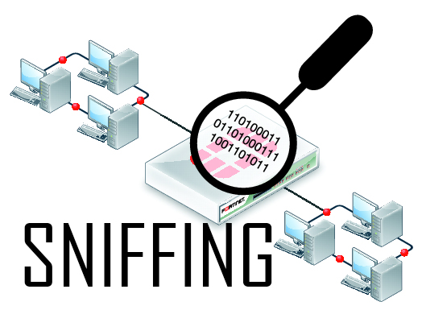
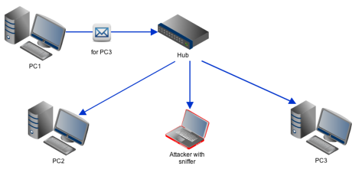

**Rangkuman Pertemuan 4 Sistem Keamanan Jaringan**

  

Latar Belakang Masalah

Pada saat ini banyak yang bisa dilakukan jika kita terhubung pada suatu jaringan internet, karena dengan menggunakan internet kita dapat dengan mudah mengakses apa yang kita butuhkan baik itu bersifat baik maupun tidak. Akan tetapi dalam penggunaan internet  banyak yang menggunakannya dengan tidak baik sehingga bisa saja merugikan orang lain seperti melakukan proses Sniffing.

1. Apa yang dimaksud dengan Sniffing?
2. Apa metode dalam melakukan Sniffing?
3. Apa saja contoh tools yang dapat digunakan dalam melakukan proses Sniffing?
4. Bagaimana contoh dalam melakukan Sniffing?
5. Apa yang harus dilakukan agar terhindar oleh penggunakan proses Sniffing?

  

Sniffing merupakan suatu proses atau praktek yang dapat digunakan untuk membaca paket jaringan IP Address dari node satu ke node yang lain

Metode yang digunakan dalam melakukan proses Sniffing adalah Intercepting, yaitu melakukan sebuah proses intercepting jaringan / masuk ke jalur jaringan dimana paket jaringan yang dituju melalui jalan itu

Contoh tools yang digunakan dalam melakukan proses Sniffing seperti, Wireshack, TCP Dump, Socket Python dan lain sebagainya

Contoh dalam melakukan Sniffing dalam mengambil username dan password dosen ketika login didalam sistem kampus yang ada. Pertama kita harus menggunakan satu jaringan dengan komputer atau laptop yang digunakan dosen dan kita atau bisa disebut kita terhubung dalam satu akses point, setelah sama – sama terhubung, kita buka program sniffer yang ada pada komputer atau laptop kita. Saat dosen melakukan login pada sistem, program sniffer yang dijalankan pada laptop kita akan bekerja dan membaca username serta password yang dimasukkan oleh dosen yang sedang login pada form html dengan method post. Jika berhasil, maka kita bisa menggunakan username dan password yang digunakan dosen untuk login karena kita telah mendapatkan username dan password dosen yang sedang login menggunakan program sniffer atau proses sniffer yang kita jalankan.

Untuk menghindari penggunaan Sniffing oleh orang lain terhadap kita, kita harus menambah sistem keamanan jaringan kita. Sebagai contoh untuk meminimalisirnya dengan cara mengganti HTTP menjadi HTTPS karena dengan HTTPS dapat men-enkripsi data yang kita miliki dengan menggunakan AES atau yang lebih tinggi. Semakin tinggi enkripsi yang kita gunakan pada HTTPS maka semakin aman data yang kita miliki

Penutup

Kesimpulan

Dari pernyataan diatas dapat disimpulkan bahwa penggunaan Sniffing mudah dilakukan dengan program sniffer yang tersedia, akan tetapi jika kita tidak pintar atau selektif dalam menggunakannya dapat merugikan orang lain karena proses Sniffing ini dapat membaca data yang kita miliki seperti username dan password dengan mudah dan cepat

Saran

Saran saya sebaiknya kita menggunakan proses Sniffing secara selektif, jadi jangan menggunakan proses Sniffing untuk hal – hal yang tidak diperlukan agar tidak merugikan orang lain

* Nama : Gilang Romadhanu Tartila
* NPM : 1144033
* Kelas : 3C
* Prodi : D4 Teknik Informatika
* Mata Kuliah : Sistem Keamanan Jaringan

Link Github : https://github.com/gilangtartila99/SistemKeamananJaringan2016

Referensi : 

1. https://en.wikipedia.org/wiki/Sniffing
2. http://www.computerhope.com/jargon/s/sniffing.htm

Scan Plagiarisme

1. smallseotools - Link https://drive.google.com/open?id=0B5gySyqZ4GGoYnF6M1JUVmVmbjg
2. duplichecker - Link https://drive.google.com/open?id=0B5gySyqZ4GGoRW0wb3JSYzI2YTg