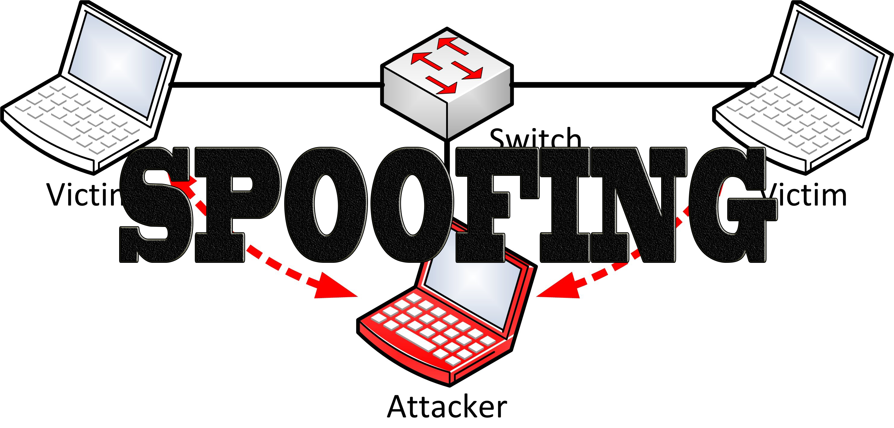

**Rangkuman Pertemuan 5 Sistem Keamanan Jaringan**

  

Latar Belakang Masalah

 Dalam sebuah jaringan banyak yang bisa merugikan penggunanya, karena jika kita sudah berada pada sebuah jaringan maka tidak ada kata aman karena pasti ada yang ingin berniat buruk yang dapat merugikan kita sebagai penggunanya, sebagai contoh yaitu Spoofing

1. Apa yang dimaksud Spoofing?
2. Apa yang dimaksud ARP Spoofing?
3. Apa yang dimaksud DNS Spoofing?
4. Bagaimana cara menggunakan Spoofing?
5. Bagaimana cara mencegahnya?

Spoofing adalah teknik yang digunakan untuk memperoleh akses yang tidak sah ke sebuah komputer atau informasi dimana penyerang berhubungan dengan pengguna dengan memalsukan bahwa mereka adalah host yang dapat dipercaya, hal ini biasanya digunakan oleh hacker

ARP Spoofing adalah konsep dari serangan penyadapan diantara terhadap dua mesin yang sedang berkomunikasi atau yang disebut dengan Man In The Middle Attack.

DNS Spoofing merupakan proses mengambil nama DNS dari sistem lain dengan membahayakan domain server suatu domain yang sah

Misalkan Komputer A ingin terhubung dengan internet, jadi Komputer A harus melewati router. Komputer A bisa menuju router dengan melihat tabel alternatif dirinya, Kemudian Komputer B mencoba menipu Komputer A agar tidak bisa terhubung internet dengan memberikan tabel palsu kepada Komputer A, sehingga Komputer A melihat tabel palsu yang diberikan oleh Komputer B dan menganggap Komputer B adalah router, otomatif aliran menuju internet terputus

Cara mencegahnya tidak menerima tabel dari siapapun dan membuat tabel statis yang tidak bisa diubah atau di-update

Penutup

Kesimpulan

Dari pernyataan diatas dapat disimpulkan bahwa Spoofing adalah alat yang dapat memberikan alamat palsu kepada korbannya sehingga korbannya tidak dapat terhubung ke internet

Saran

Sebaiknya kita menggunakan tabel statis agar tidak dapat diedit dan terhindar dari proses Spoofing

* Nama : Maizar Fernando
* NPM : 1144109
* Kelas : 3C
* Prodi : D4 Teknik Informatika
* Mata Kuliah : Sistem Keamanan Jaringan

Link Github : https://github.com/maizar08/sistemkeamananjaringan/

Referensi : 

1. https://en.wikipedia.org/wiki/Spoofing_attack

Scan Plagiarisme

1. smallseotools - Link https://drive.google.com/open?id=0B5gySyqZ4GGoQ00xcE14SEhEMDg
2. searchenginereport - Link https://drive.google.com/open?id=0B5gySyqZ4GGoa21zOEloYzJONVk