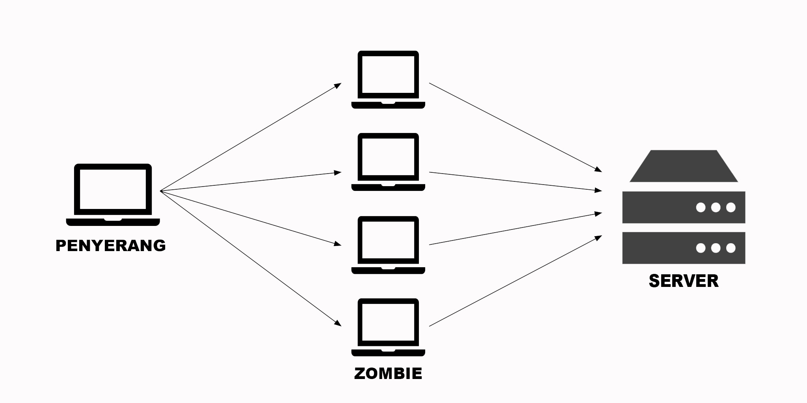

**Rangkuman Pertemuan 6 Sistem Keamanan Jaringan**

  

Latar Belakang Masalah

Saat ini banyak cara yang dilakukan oleh hacker untuk merusak ataupun membuat sistem tidak berjalan dengan baik, tetapi jika seorang hacker sudah tidak ada cara lain untuk melakukan hacking maka ada satu cara terakhir yang dapat dilakukan yaitu Denial Of Service atau biasa disebut DOS

1. Apa yang dimaksud Denial Of Service (DOS)?
2. Bagaimana sistem DOS/DDOS ini berjalan?
3. Bagaimana cara melakukan pencegahannya?

Denial Of Service (DOS) adalah cara terakhir yang dilakukan hacker jika semua cara yang dilakukan hacker tidak berhasil masuk kedalam sistem dengan membuat server sibuk sendiri oleh permintaan kita sehingga server tidak sempat melayani permintaan yang lain

Jika yang melakukan request tidak hanya satu program pengirim permintaan tapi ada banyak program yang berjalan pengirim permintaan secara bersamaan, maka ini disebut dengan Distributed Denial Of Service (DDOS)

  

Dikarenakan server disini memberi layanan dari permintaan yang dikirim oleh client maka disini server memiliki kapasitas memberikan layanan untuk melayani permintaan client. Cara kerja dari DOS/DDOS ini sendiri membuat server sibuk melayani permintaan client, misalkan server memiliki batas maksimal jumlah yang bisa dilayani, maka penyerang membuat suatu sistem yang membuat penyerang memiliki banyak program berjalan yang mengirim permintaan kepada server sampai server tidak bisa melayani permintaan lagi atau kita sebut denied

Cara melakukan pencegahan terhadap DOS/DDOS belum ada karena kita berada pada sistem client server, jadi tidak ada cara pencegahannya. Tapi ada cara meringankan kita untuk sedikit terhidar dari DOS dan DDOS yaitu, Menaikan kapasitas layanan jika penyerang tidak menaikkan kapasitas permintaan, Memblok IP penyerang di firewall, Masukkan semua IP penyerang ke firewall dan Membuat Honey Pot(membuat program dan di-coding)

Penutup

Kesimpulan
Dari pernyataan diatas dapat disimpulkan bahwa DOS ini adalah suatu cara seorang hacker untuk membuat server sibuk dengan mengirim banyak permintaan sampai server tidak dapat melayani lagi permintaan sehingga menjadi Denied

Saran
Sebaiknya ketika kita membuat suatu solusi untuk menangani DOS dan DDOS karena saat ini belum ada cara untuk menangani ataupun mencegah sistem DOS dan DDOS tidak terjadi kepada kita

* Nama : Gilang Romadhanu Tartila
* NPM : 1144033
* Kelas : 3C
* Prodi : D4 Teknik Informatika
* Mata Kuliah : Sistem Keamanan Jaringan

Link Github : https://github.com/gilangtartila99/SistemKeamananJaringan2016

Referensi : 

1. https://id.wikipedia.org/wiki/Serangan_DoS

Scan Plagiarisme

1. smallseotools - Link https://drive.google.com/open?id=0B5gySyqZ4GGoeTNUWEJJTlNFMk0
2. searchenginereport - Link https://drive.google.com/open?id=0B5gySyqZ4GGoQTc4aXVxQUJKakU